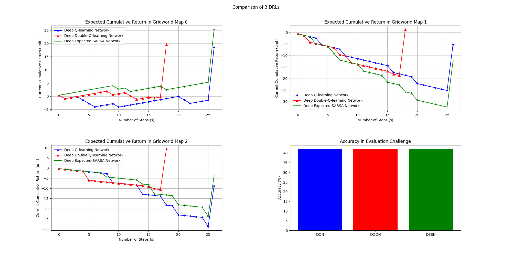

# Gridworld (10x10) Deep Reinforcement Learning

## Overview
This project implements and compares three different Deep Reinforcement Learning (DRL) architectures—Deep Q-Learning (DQN), Double Deep Q-Learning (DDQN), and Deep Expected SARSA—within a 10×10 Gridworld environment. The goal is to train an agent to navigate the grid, avoid obstacles, and reach the target state efficiently. The project includes data preprocessing, model training, and a performance evaluation based on accuracy and expected cumulative returns.

## Dataset Information 

The environment is represented by 10×10 grids where different cell values represent specific entities. The model learns from transitions stored in CSV format, capturing the state-action-reward dynamics.

* **Files:** `train.csv`, `eval_challenge.csv`, `eval_solution.csv`, `sample_gridworld_map_0.csv`, `sample_gridworld_map_1.csv`, `sample_gridworld_map_2.csv`
* **Grid Size:** 10 x 10 (100 discrete states)
* **Total Trainsitions:** 22,000+

### Environemnt Variables

| Variable | Description |
| :--- | :--- |
| **state** | The current position of the agent (represented as a flattened index from 0-99). They are represented as row (index // 10) and column (index % 10)|
| **action** | The movement taken by the agent (0: Up, 1: Down, 2: Left, 3: Right). |
| **reward** | Numerical feedback from the environment (+20 for goal, +0.4 for safe move, -3.0 / -2.0 / -1.3 for hard / soft obstacles, -0.3 for escaping grid / hitting wall). |
| **next_state** | The resulting position after taking an action. |
| **done** | Boolean flag indicating if the episode has ended (maximum length of trajectory or terminal state). |
| **grid's value** | Express status of current state of the agent (0: Safe, 1: Obstacle, 2: Starting State, 3: Termination). |


## File Description

| File Name | Description |
|---|---|
| `main.py` | The core script for the Gridworld project. It handles data preprocessing, initializes multiple DRL agents (DQN, Double DQN, and Expected SARSA), runs the training loops, and evaluates performance via accuracy and expected cumulative return. |
| `Comparison_of_3_DRLs.png` | A visualization comparing the performance metrics (likely training loss or reward over time) for the three implemented Reinforcement Learning algorithms. |
| `train.csv` | The primary training dataset containing state-action transitions: state, action, reward, next_state, and done flags for the Gridworld agent. |
| `eval_challenge.csv` | A testing dataset where the action and reward columns are placeholders (-1 or -999), used to challenge the trained models to predict the correct behavior. |
| `eval_solution.csv` | The ground-truth "answer key" for the challenge set, containing the optimal actions and actual rewards used to calculate model accuracy.|
| `sample_gridworld_map_x.csv` | (x: 0, 1, and 2) CSV representations of the 10x10 Gridworld layouts, where numeric values (0, 1, 2, 3) likely represent empty cells, obstacles, start points, and goal states. |


## Methodology

### 1. Data Understanding & Preprocessing
* Feature Engineering: Discrete states are transformed into one-hot encoded vectors of size 100 to be processed by neural networks.

* Data Cleaning: The check_and_clean_dataset function audits train.csv, eval_challenge.csv, and eval_solution.csv for missing values and data type consistency.

* Dimension Preparation: transforming raw Gridworld data into a structured format that a neural network can process

### 2. Deep Q-Learning Network (DQN)
An on-policy approach that uses a Target Network (periodically updated every 100 batches) to calculate the maximum potential Q-value for the next state, reducing moving target instability.

### 3. Deep Double-Q-learning Network (DDQN)
Employs two independent networks to decouple action selection from action evaluation, effectively mitigating the overestimation bias common in standard DQN.

### 4. Deep Expected-SARSA Network (DESN)
An on-policy approach that calculates the expected value across all possible next actions based on their probability distribution, rather than just taking the maximum.

### 5. Optimization & Evaluation

* **Loss Function**: The Huber Loss is implemented, which is less sensitive to outliers than mean squared error.
* **Optimizer**: The Adam optimizer is used with a learning rate ($\alpha = 0.005$) and specific beta parameters ($0.9, 0.999$).
* **Performance Metrics**:
    * **Accuracy**: Measures how often the model's predicted action matches the "optimal" action in the `eval_solution.csv`.
    * **Expected Cumulative Return**: Tracks the total reward accumulated over time as the agent attempts to reach the terminal state (99) while avoiding obstacles for different gridworld map (0, 1 and 2).

## Visualization and Analysis



#### Comparison Summary

| Architecture | Map 0 Performance | Stability | Evaluation Accuracy |
| :--- | :--- | :--- | :--- |
| **DQN** | High Final Peak | Moderate | 42% |
| **DDQN** | **Early Reward Spike** | **High** | 42% |
| **DESN** | Highest Overall | Moderate | 42% |

#### Key Analysis

* **Reward Dynamics**: 
    * **DQN (Blue)** serves as a solid baseline but proves more volatile in complex environments (Map 2), where it experienced the steepest decline in cumulative returns.
    * **DDQN (Red)** consistently identifies high-reward states earlier (around Step 18) across all maps, suggesting a more aggressive path-finding behavior, though it occasionally misses the terminal peak in Map 0.
    * **DESN (Green)** demonstrates superior stability in Map 0, maintaining a positive cumulative return throughout the episode and reaching the highest final reward.

* **Evaluation Accuracy**:
    * All three architectures achieved an identical accuracy of **42%** in the Evaluation Challenge. This indicates that while the learning trajectories differ, the resulting policies converge to the same level of decision-making proficiency relative to the optimal solution.


## Technical Stack

| Area | Technologies |
|---|---|
| **Programming Language** | Python 3 |
| **Libraries** | pandas, numpy, matplotlib, scikit-learn, pytorch |
| **Models** | Deep Q-Learning Network, Deep Double-Q-Learning Network, Deep Expected-SARSA Network |
| **Techniques** | HuberLoss, Adam Optimizer, Neural Network |

## How to Run

1.  **Clone the Repository**:
    ```bash
    cd "Your Directory"
    git clone https://github.com/Dochikhoa2006/GridWorld-DRL.git
    ```

2.  **Install Dependencies**:
    Make sure you have Python and the necessary libraries installed:
    ```bash
    pip install pandas matplotlib scikit-learn torch torchvision torchaudio
    ```

3.  **Data Preparation**:
    Ensure all related csv file are in the same directory as the scripts.

4.  **Training and Evaluation**:
    ```bash
    python main.py
    ```

> **Note:** Accessing to directory of scripts before running

## License

This project is licensed under the **CC-BY (Creative Commons Attribution)** license.

## Citation

Do, Chi Khoa (2026). *MovieLens 100k*.  

🔗 [Project Link](https://github.com/Dochikhoa2006/GridWorld-DRL)

## Acknowledgements

This README structure is inspired by data documentation guidelines from:

- [Queen’s University README Template](https://guides.library.queensu.ca/ReadmeTemplate)  
- [Cornell University Data Sharing README Guide](https://data.research.cornell.edu/data-management/sharing/readme/)  

This project utilizes the **Gridworld-10 Dataset**, available on Kaggle:

- [Gridworld-10: An Offline RL Dataset](https://www.kaggle.com/datasets/sainideeshk/gridworld-10-an-offline-rl-dataset)

## Contact
If you have any questions or suggestions, please contact [dochikhoa2006@gmail.com](dochikhoa2006@gmail.com).


