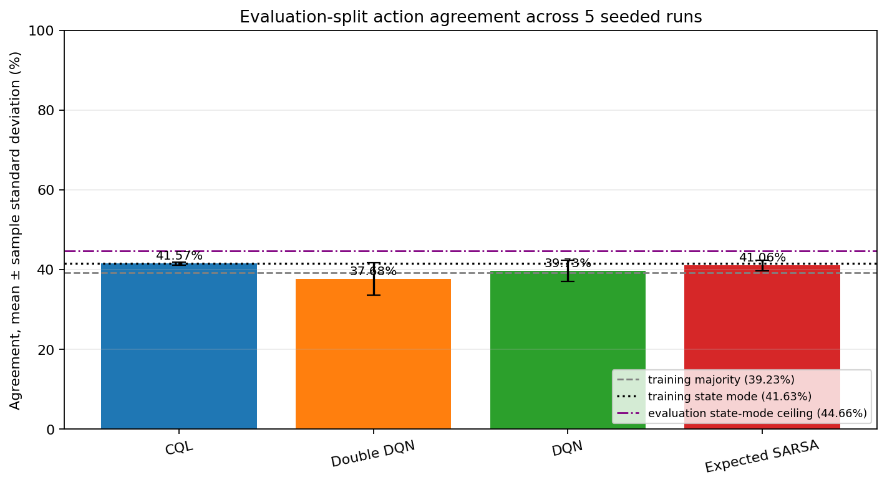

# Gridworld-10: Reproducible Offline RL Baselines

[](https://github.com/Dochikhoa2006/GridWorld-Deep-Reinforcement-Learning/actions/workflows/ci.yml)
[](pyproject.toml)
[](https://pytorch.org/)
[](pyproject.toml)
[](LICENSE)

A compact PyTorch research pipeline for comparing value-based algorithms on a fixed
10 × 10 Gridworld transition dataset. The project emphasizes algorithm correctness,
offline-RL failure modes, reproducible experiments, and evidence a reviewer can
inspect.

**DQN · Double DQN · Expected SARSA · discrete Conservative Q-Learning**

**Official repository:**
[Dochikhoa2006/GridWorld-Deep-Reinforcement-Learning](https://github.com/Dochikhoa2006/GridWorld-Deep-Reinforcement-Learning)

[Quick start](#quick-start) ·
[Diagnostic result](docs/results/BENCHMARK.md) ·
[Architecture](docs/ARCHITECTURE.md) ·
[Reproducibility](docs/REPRODUCIBILITY.md) ·
[Technical audit](docs/TECHNICAL_AUDIT.md) ·
[Contributing](CONTRIBUTING.md)

## Project at a glance

|                               |                                                                                                                                         |
| ----------------------------- | --------------------------------------------------------------------------------------------------------------------------------------- |
| **Research question**   | How do standard value-learning targets compare with a conservative offline baseline when learning only from logged transitions?         |
| **Evaluation**          | Greedy action agreement on the provided evaluation split, with overlap, ambiguity, trivial-reference, confusion, and recall diagnostics |
| **Experiment contract** | Validated CSV input → seeded training → checkpoints and JSON metrics → deterministic report generation                               |
| **Engineering stack**   | Python 3.11+, PyTorch, NumPy, pandas, Matplotlib, pytest, GitHub Actions, Docker                                                        |
| **Quality gates**       | Dataset-free unit/integration tests with ≥85% coverage, Ruff, package build, installed-wheel, and CLI smoke checks                     |

This is intentionally an inspectable baseline suite, not a claim of
state-of-the-art performance. It makes a narrow experiment easy to audit: target
equations are isolated, data is validated before training, resolved settings and
dataset fingerprints travel with each run, and multi-seed results can be generated
without hand-assembling metrics.

## Why this repository is reviewable

- **Correct target roles.** DQN bootstraps from the target network; Double DQN uses
  the online network for selection and the target network for evaluation.
- **Explicit policy expectation.** Expected SARSA builds a normalized
  epsilon-greedy distribution and evaluates its full expectation.
- **Offline-aware baseline.** Discrete CQL adds a conservative penalty to discourage
  inflated values for actions not supported by the logged data.
- **Fail-fast data boundary.** Schema, numeric types, finite rewards, state/action
  ranges, terminal values, and challenge/solution row alignment are checked before
  optimization. Duplicate required CSV headers are rejected before parsing.
  CSV state and action IDs are checked without floating-point rounding, so
  fractional IDs cannot be silently accepted.
- **Traceable outputs.** Every run stores its resolved configuration, source
  revision/working-tree state when Git is available, package and dependency
  versions, dataset SHA-256 fingerprints, model checkpoints, predictions, metrics,
  figures, and an integrity manifest. Dataset fingerprints are checked before and
  after loading and again before publication; changed inputs abort the run.
- **Coverage diagnostics.** Logged state/action coverage, per-action counts, terminal
  fraction, and reward statistics make dataset imbalance visible beside model
  metrics.
- **Evaluation audit.** Exact train/evaluation overlap, duplicate transitions,
  conflicting per-state labels, a training-majority reference, a training
  state-mode reference, and an evaluation-fitted state-mode ceiling prevent an
  overlapping split from being mistaken for out-of-sample evidence.
- **Automated evidence.** Focused unit tests cover target equations and validation;
  integration tests exercise the CLI, deterministic runs, checkpoint loading,
  report regeneration, and multi-seed aggregation.

## Algorithms

Let $Q_\theta$ be the online network, $Q_{\bar{\theta}}$ the synchronized target
network, $d$ the terminal flag, and $\gamma$ the discount factor.

| Method                   | Bootstrap value                                                                   | Role in the comparison                                         |
| ------------------------ | --------------------------------------------------------------------------------- | -------------------------------------------------------------- |
| **DQN**            | $\max_a Q_{\bar{\theta}}(s',a)$                                                 | Standard off-policy value-learning baseline                    |
| **Double DQN**     | $Q_{\bar{\theta}}(s', \arg\max_a Q_\theta(s',a))$                               | Decouples next-action selection from evaluation                |
| **Expected SARSA** | $\sum_a \pi_\epsilon(a\mid s')Q_{\bar{\theta}}(s',a)$                           | Uses the online network's epsilon-greedy policy expectation    |
| **Discrete CQL**   | DQN target plus $\alpha[\log\sum_a e^{Q_\theta(s,a)}-Q_\theta(s,a_\mathcal{D})]$ | Penalizes relative value assigned away from the dataset action |

All targets use $y=r+\gamma(1-d)\times\text{bootstrap}$, so terminal transitions
do not bootstrap. The optimization objective is Huber TD loss, with gradient
clipping and periodic target-network synchronization.

> [!IMPORTANT]
> Expected SARSA is used here as an **offline Expected SARSA-style baseline**. The
> fixed dataset was not generated by the changing learned policy, so this is not a
> fully on-policy experiment. CQL addresses one form of offline overestimation; it
> does not guarantee a safe or optimal policy.

## Quick start

### 1. Install

Python 3.11 is the reference runtime.

```bash
git clone https://github.com/Dochikhoa2006/GridWorld-Deep-Reinforcement-Learning.git
cd GridWorld-Deep-Reinforcement-Learning

python3.11 -m venv .venv
source .venv/bin/activate
python -m pip install --upgrade pip
python -m pip install -e '.[dev]'
```

On Windows PowerShell, activate the environment with
`.venv\Scripts\Activate.ps1`.

You can also run the CLI through the active Python environment with
`python -m gridworld_rl`. To see the available commands, run:

```bash
python -m gridworld_rl --help
```

### 2. Add the dataset

Obtain
[Gridworld-10: An Offline RL Dataset](https://www.kaggle.com/datasets/sainideeshk/gridworld-10-an-offline-rl-dataset)
from its authorized source and place these required files locally:

```text
Gridworld-10_Dataset/
├── train.csv
├── eval_challenge.csv
└── eval_solution.csv
```

The dataset is intentionally ignored by Git and is not covered by this repository's
MIT license. Sample map CSVs distributed with the dataset are optional; the current
training and evaluation pipeline does not consume them.

> [!CAUTION]
> The current tree excludes the CSVs, but legacy commits in the existing Git history
> contain dataset blobs. An ignore rule does not remove history. Do not claim that
> the existing remote has never redistributed the dataset; create a clean-history
> showcase repository or perform an explicitly approved, coordinated history rewrite
> before public promotion. See the [migration guide](docs/MIGRATION.md#dataset-history-blocker).

### 3. Validate before training

```bash
gridworld-rl validate --config configs/default.json
```

The command checks the configured files, verifies that evaluation rows align, and
prints training state-action coverage plus exact evaluation/training transition
overlap. Use `--json` for row counts and the full training and evaluation-split
diagnostics in one machine-readable object. It creates no run artifacts. A missing
or malformed dataset exits with a contextual error before model training.

### 4. Run one experiment

```bash
gridworld-rl train \
  --config configs/default.json \
  --device cpu \
  --seed 42 \
  --run-name smoke-seed-42
```

For a direct training invocation, option-only arguments default to the `train`
command. The following uses the conventional dataset directory and the requested
50-epoch configuration:

```bash
gridworld-rl \
  --data-dir Gridworld-10_Dataset \
  --epochs 50 \
  --seed 42 \
  --cql-alpha 1.0
```

Training evaluates every configured algorithm and writes a complete run under
`artifacts/smoke-seed-42/`. Outputs are built in a hidden staging directory and
published only after the run completes. An existing name is refused by default; use
a new name to preserve evidence, or pass `--overwrite` only when you intentionally
want an atomic replacement.

To train only selected baselines, pass `--algorithms dqn cql` to `train` or
`benchmark`. The chosen order is saved in the run configuration; duplicate and
unsupported names are rejected.

### 5. Run a multi-seed comparison

```bash
gridworld-rl benchmark \
  --data-dir Gridworld-10_Dataset \
  --epochs 50 \
  --device cpu \
  --cql-alpha 1.0 \
  --seeds 11 22 33 44 55 \
  --output-dir artifacts/benchmarks \
  --name linkedin-50-epoch-five-seed
```

This creates one full run per seed plus aggregate JSON, a mean/standard-deviation
figure, a Markdown summary, and integrity manifests. Benchmark artifacts are built
in a hidden staging directory and published at the requested path after all
seeded runs, aggregation, reports, and hashes complete. Failures remove the
staging directory and leave the requested path untouched. Five seeds illustrate the
workflow; the seed schedule and sample size should be chosen before inspecting
results. Benchmark names are immutable: an existing destination is always refused,
so choose a new name for every retained comparison.

Experiment summaries and benchmark aggregates also break action agreement down by
exact transitions found in training, new transitions at states seen in training,
and states never seen in training. These three groups cover each evaluation row
once. Empty groups report `N/A`; they do not imply zero accuracy. Benchmark tables
show the mean and sample standard deviation across seeds for each nonempty group.
These figures describe agreement on the provided split, not environment return.

Run metrics also include the fraction of evaluation rows whose state-action
pair was observed in training. This pair overlap includes new transitions at a
previously seen pair and is shown in the experiment summary. Metrics also include
per-action precision and F1, predicted-action counts, and macro F1. The
experiment summary lists precision and F1 next to each action's
support and prediction count. Macro F1 averages the F1 values of actions with
at least one true evaluation row; actions with no true rows are excluded. An
undefined precision or recall is recorded as zero. Benchmark summaries include
the mean and sample standard deviation of macro F1 across seeds.

For runs with multiple algorithms, `metrics.json` includes a `policy_agreement`
matrix of identical predicted-action rates and disagreement counts on aligned
evaluation rows. The experiment summary displays the rate matrix. This comparison
uses no solution labels, so agreement does not imply correctness.
Multi-seed benchmarks summarize each algorithm pair's policy agreement rate and
number of differing rows across matching seeds. The aggregate JSON preserves the
per-seed values and rejects inconsistent agreement matrices.

Benchmarks also compare every algorithm pair on matching seeds. The aggregate
JSON's `paired_comparisons` contains each seed's agreement difference, its mean,
sample standard deviation, minimum and maximum, and seed-level win/tie/loss counts.
Pairs are ordered alphabetically; differences are first minus second. The Markdown
summary expresses differences in percentage points, with positive values favoring
the first algorithm. These are descriptive comparisons, not significance tests.
One seed produces a standard deviation of zero; a single algorithm produces no
pairs. Aggregation rejects duplicate seeds, mismatched seed metadata, and invalid
agreement values.

Benchmarks also report action stability for each algorithm across seed pairs.
The aggregate JSON's `action_stability` records agreement on identical evaluation
rows for every pair, plus the mean and sample standard deviation of those pairwise
rates. This uses saved predictions without consulting solution labels. A high rate
means the algorithm tends to choose the same actions across seeds; it does not
establish that those actions are correct. Aggregation checks prediction actions and
row alignment before publishing the benchmark.
When saved runs include integrity manifests, aggregation verifies every run before
reading its metrics and refuses a mixture of manifested and unmanifested runs.
Legacy run bundles without manifests remain supported.

### 6. Run the test suite

```bash
make check
```

The local quality gate checks Ruff lint/formatting, tests with enforced coverage,
package builds, and both CLI entry points. The tests use synthetic fixtures and do
not require the external Gridworld dataset. Use `python -m pytest -q` when only the
test suite is needed.

For a quicker check while developing, run only the unit tests:

```bash
make test-unit
```

## Verified five-seed release-candidate benchmark

The real dataset was exercised locally for 50 epochs on CPU across seeds 11, 22,
33, 44, and 55. All runs reference clean source commit `7ba76df`, record identical
dataset and runtime provenance, and pass the generated integrity manifest. The table
reports provided evaluation-split action agreement as mean ± sample standard
deviation—not out-of-sample generalization or environment return.

| Algorithm                                     | Action agreement |
| --------------------------------------------- | ---------------: |
| CQL                                           |  41.38% ± 0.01% |
| Expected SARSA                                |  33.79% ± 5.02% |
| Double DQN                                    |  32.97% ± 5.29% |
| DQN                                           |  31.37% ± 2.34% |
| Training-majority reference (always action 1) |           39.23% |
| Training per-state-mode reference             |           41.63% |
| Evaluation-fitted state-mode ceiling          |           44.66% |

The first two references are selected from training data and scored on the
evaluation split. The ceiling is an explicitly label-fitted diagnostic: it is not a
fair predictive baseline.

[](docs/results/BENCHMARK.md)

The evaluation split is not substantively held out: 5,491 of 5,544 rows (99.04%)
exactly match training transitions, 5,010 rows duplicate another evaluation row,
and 77 of 91 states have conflicting action labels. Every method had very low recall
for actions 0 and 2; CQL's extremely small overall standard deviation coincided with
98.72% mean recall for action 3 and near-zero recall for actions 0 and 2. No learned
mean exceeded the 41.63% training per-state-mode reference. These results demonstrate
why the pipeline preserves overlap, ambiguity, and class-level diagnostics; they do
**not** establish algorithm superiority, broad policy stability, or out-of-sample
policy quality. The [benchmark note](docs/results/BENCHMARK.md) records the complete
config, commit, hashes, runtime, ranges, per-action recalls, and claim boundary.

## Evaluation: what the score means

The primary metric is **provided evaluation-split action agreement**: the greedy
model action is compared with the action in `eval_solution.csv`. Each report
includes overall agreement, a four-class confusion matrix, per-action recall, and
support, alongside overlap, duplication, label-conflict, and trivial-reference
diagnostics.

Action agreement is useful for inspecting behavior against the supplied labels, but
it is not:

- an out-of-sample generalization estimate, because the split substantially
  overlaps training;
- an online-policy return;
- proof that a label is the only optimal action;
- evidence of robustness under a different state-action distribution; or
- evidence that one algorithm is statistically superior after a single seed.

The diagnostic snapshot above is tied to a documented local run; it is not a generic
performance claim. Publish metrics only from a clean, versioned run; retain the
configuration and data fingerprints; aggregate declared seeds; and disclose any
tuning against the evaluation labels. See the
[reproducibility protocol](docs/REPRODUCIBILITY.md) for the full checklist.

## Configuration

[`configs/default.json`](configs/default.json) is an executable, versioned experiment
specification. Major controls include:

| Setting                             | Purpose                                                     |
| ----------------------------------- | ----------------------------------------------------------- |
| `training.algorithms`             | Algorithms included in a run                                |
| `training.seed`                   | Python, NumPy, PyTorch, and data-order seed                 |
| `training.epochs`                 | Full passes over the fixed transition dataset               |
| `training.learning_rate`          | Base Adam learning rate                                     |
| `training.learning_rate_schedule` | `constant` (default) or `cosine`                             |
| `training.warmup_steps`           | Linear warmup optimizer updates (default: 0)                |
| `training.min_learning_rate_ratio` | Cosine endpoint as a fraction of the base rate (default: 0) |
| `training.batch_size`             | Transitions per minibatch                                   |
| `training.gradient_accumulation_steps` | Minibatches per optimizer update (default: 1)           |
| `training.max_optimizer_steps`  | Optional cap on optimizer updates (`null` by default)      |
| `training.gamma`                  | Bellman discount factor                                     |
| `training.epsilon`                | Expected SARSA epsilon-greedy probability                   |
| `training.cql_alpha`              | Conservative penalty weight                                 |
| `training.target_update_interval` | Optimizer steps between target-network updates              |
| `training.target_update_tau`      | Target blend at each update; `1` means a full copy           |
| `training.gradient_clip_norm`     | Maximum gradient norm                                       |
| `training.device`                 | `auto`, `cpu`, `cuda`, or `mps`                     |
| `network.hidden_sizes`            | Q-network hidden-layer widths                               |
| `output.overwrite`                | Whether a single-run destination may be atomically replaced |

The CLI exposes common single-run overrides; edit or copy the JSON config for a fully
versioned experiment definition. Unknown fields and invalid ranges are rejected.
Duplicate JSON keys and non-standard values such as `NaN` are rejected before
training, including inside nested sections.

To use an effective batch of 512 transitions while processing 128 at a time:

```bash
gridworld-rl train --batch-size 128 --gradient-accumulation-steps 4 --run-name accumulated
```

The same override is available for `benchmark`. Gradients are weighted by the
number of transitions, and an incomplete accumulation window is applied at the
end of each epoch. Gradient clipping, `global_steps`, and target-network updates
operate on optimizer updates. Epoch losses are averages over transitions, so a
short final minibatch is weighted correctly. The default of 1 keeps one optimizer
update per minibatch.
`training_history.mean_gradient_norm` records the average pre-clipping norm
per optimizer update in each epoch, and `training_history.clipped_fraction`
records the share of updates whose norm exceeded the configured limit. The
experiment summary displays both values for the final recorded epoch.

To cap training work, pass `--max-optimizer-steps 1000` to `train` or
`benchmark`. The cap counts optimizer updates after gradient accumulation. If it
falls inside an epoch, training stops after the complete accumulation window and
records that partial epoch's losses. Saved metrics include `planned_global_steps`,
`completed_epochs`, and `partial_epoch_batches`; `global_steps` is the number
actually run. When a cap is active, warmup and cosine decay use the capped update
count, so warmup must be shorter than that count.

Optional learning-rate warmup and cosine decay are available for both `train` and
`benchmark`, for example `--learning-rate-schedule cosine --warmup-steps 10
--min-learning-rate-ratio 0.1`. Warmup uses rates `base / warmup_steps` through
`base`; subsequent updates decay to the configured floor on the final update.
Without warmup, cosine starts at the base rate (a single-update run uses that
rate). Warmup must be shorter than the total optimizer-update count. Schedules
advance only when the optimizer steps, including partial accumulation windows.
The constant schedule optionally warms up, then holds the base rate; its floor
ratio has no effect. `training_history.learning_rate` records the last rate used
in each epoch. Defaults preserve constant-rate training.

Target-network updates can also blend weights gradually with
`--target-update-tau 0.05` (available for `train` and `benchmark`). At each
`target_update_interval` optimizer updates, the target becomes
`(1 - tau) * target + tau * online`. The default `tau = 1` retains full copies;
`0 < tau < 1` uses smoothing. The target starts as an exact copy of the online
network, and `target_synchronizations` counts that initial copy plus scheduled
updates. The setting is saved with the run configuration.

Training rejects non-finite Q-values, losses, accumulated gradient norms, and
updated model parameters. Errors identify the algorithm, epoch, minibatch, and
optimizer update. A failed experiment removes its staging directory and preserves
any previously published run, including when `--overwrite` was requested.
Prediction also rejects non-finite Q-values instead of selecting an arbitrary
action, and experiment metrics cannot serialize NaN or infinity.

Evaluation converts state arrays to Torch tensors one batch at a time, so
inference does not copy the entire evaluation split into a second state array.
The Q-network handles integer states by gathering the first layer's weight
column directly. This produces the same values and gradients as a one-hot input
without allocating a dense one-hot batch. Vector state inputs and saved
checkpoint parameter names remain compatible.
DQN and CQL also skip the online next-state forward pass because their Bellman
targets use only the target network. Double DQN and Expected SARSA retain both
next-state evaluations. All four algorithms skip next-state inference for
terminal transitions, whose Bellman targets equal the observed reward.

## Artifact contract

A single run is self-describing at the experiment level:

```text
artifacts/<run-name>/
├── checkpoints/
│   ├── dqn.pt
│   ├── double_dqn.pt
│   ├── expected_sarsa.pt
│   └── cql.pt
├── config.json
├── metrics.json
├── predictions.json
├── report.png
├── confusion_matrices.png
├── summary.md
└── manifest.json
```

`predictions.json` follows challenge-row order and deliberately excludes solution
labels. `metrics.json` includes source revision metadata, package/runtime versions,
dataset hashes and coverage diagnostics, optimization histories, and evaluation
metrics.

To predict actions for your own states, create a CSV with one `state` column and
one integer state per row, then run:

```bash
gridworld-rl predict \
  --checkpoint artifacts/smoke-seed-42/checkpoints/dqn.pt \
  --input states.csv \
  --output predictions.csv
```

The output keeps input row order and duplicates, with `state`, greedy `action`,
`action_gap`, and one `q_<action>` column per action. State IDs must fall within
the checkpoint's configured state range. Add `--compact` to omit the Q-value
columns when only actions and gaps are needed.
Predictions use the lowest action index
when Q-values tie. The output is written as a new file; an existing destination
is never replaced. Input rows are validated and processed in batches, so the
entire CSV need not be held in memory. `--batch-size` and `--device` control
inference. The checkpoint and input CSV are fingerprinted before and after
prediction; a changed input prevents publication. Q-values are model estimates,
not probabilities. Keep this CSV outside retained run and benchmark directories
so their integrity manifests remain valid.

`manifest.json` records SHA-256 hashes for the other run files. Reports are derived
from saved metrics and can be regenerated without retraining:

```bash
gridworld-rl report --run-dir artifacts/smoke-seed-42
```

Verify a saved experiment or an entire multi-seed benchmark without changing files:

```bash
gridworld-rl verify --run-dir artifacts/smoke-seed-42
gridworld-rl verify --run-dir artifacts/benchmarks/five-seed-study
```

For CI, add `--json` to print one JSON object with `valid`, `checked_files`,
and sorted `missing`, `modified`, and `unexpected` file lists. Invalid or unreadable
manifests produce a JSON `error` string. Exit codes remain `0` for intact
artifacts, `1` for mismatches, and `2` for invalid manifests.

Verification checks every SHA-256 entry, including nested run manifests in a
benchmark, and reports all missing, modified, and unexpected files. Exit status
is `0` for an intact artifact directory, `1` for file mismatches, and `2` for an
invalid or unreadable manifest/directory. Empty directories are ignored. Manifest
paths must be relative and canonical; symbolic links are rejected. Hashes detect
changes relative to the manifest, but do not authenticate its author. Regenerating
a report verifies existing source artifacts and refuses modified, missing, or
unexpected files outside the derived report files. Damaged or missing figures and
summary can be regenerated; a successful refresh updates the run manifest. Doing
so inside a benchmark can invalidate the benchmark's original manifest.

See [Architecture](docs/ARCHITECTURE.md) for component and data-flow details.

### Inspect a checkpoint

```bash
gridworld-rl inspect-checkpoint \
  --checkpoint artifacts/smoke-seed-42/checkpoints/dqn.pt \
  --json
```

Inspection validates the checkpoint and reports its algorithm, dimensions, hidden
layers, parameter count, seed, optimizer steps, and SHA-256 fingerprint. Omit
`--json` for readable text. It does not run inference or create output files.

### Export a trained policy

Inspect every discrete state without training again or supplying evaluation data:

```bash
gridworld-rl export-policy \
  --checkpoint artifacts/smoke-seed-42/checkpoints/dqn.pt \
  --output artifacts/dqn-policy.json \
  --batch-size 256
```

The JSON includes checkpoint SHA-256 provenance, model dimensions, and a `policy`
array in ascending state order. Each row contains `state`, the greedy `action`,
`q_values` in action-index order, `action_gap` (largest minus second-largest
Q-value), and `num_greedy_actions` (exact ties at the maximum). Ties select the
lowest action index. Q-values and action gaps are model estimates, not calibrated
probabilities or confidence intervals. The export covers unobserved states too;
it does not establish that those predictions are reliable.

Inference defaults to CPU; `--device auto`, `cuda`, or `mps` selects another
available device. Checkpoint dimensions, architecture, version, and finite weights
are validated before export, including layer names, tensor shapes, and dtypes.
Existing output paths are refused, and the completed JSON is published atomically.
Store exports outside immutable run/benchmark directories to keep their integrity
manifests valid.

Policy rows are written in batches to a temporary file, so export memory use
does not grow with the number of states.

## Repository structure

```text
.
├── .github/                     # CI and contributor workflows
├── configs/
│   └── default.json             # Reference experiment specification
├── docs/
│   ├── ARCHITECTURE.md          # Components, boundaries, and extension points
│   ├── REPRODUCIBILITY.md       # Experiment and reporting protocol
│   ├── TECHNICAL_AUDIT.md       # Findings that motivated the refactor
│   ├── MIGRATION.md             # Upgrade path from the legacy script
│   ├── results/                 # Candid, provenance-labelled verification
│   └── legacy/                  # Clearly labelled historical material
├── src/gridworld_rl/
│   ├── algorithms.py            # Bellman targets and CQL objective
│   ├── benchmark.py             # Repeated-seed orchestration and aggregation
│   ├── data.py                  # Validation, Dataset, and DataLoader
│   ├── models.py                # Discrete-state Q-network
│   ├── trainer.py               # Training and run artifact orchestration
│   ├── evaluation.py            # Predictions and classification metrics
│   ├── checkpoints.py           # Validated checkpoint loading
│   ├── report.py                # Per-run figures and Markdown
│   ├── reproducibility.py       # Seeding, device selection, and hashing
│   └── cli.py                   # `gridworld-rl` command surface
├── tests/
│   ├── unit/                    # Equations, metrics, and data contracts
│   └── integration/             # End-to-end runs and artifact checks
├── Dockerfile
├── pyproject.toml
└── README.md
```

Generated artifacts and third-party data are intentionally outside the source tree
and excluded from version control.

## Docker

Build the CPU image and inspect the CLI:

```bash
docker build -t gridworld-rl .
docker run --rm gridworld-rl --help
```

Train with a read-only dataset mount and a writable artifact mount:

```bash
docker run --rm \
  -v "$PWD/Gridworld-10_Dataset:/app/Gridworld-10_Dataset:ro" \
  -v "$PWD/artifacts:/app/artifacts" \
  gridworld-rl train --config configs/default.json
```

The runtime uses an unprivileged user. Host bind-mount permissions must still allow
that user to write the artifact directory.

## Scope and limitations

- Optimization is offline: the agent cannot collect corrective transitions.
- The supplied evaluation labels may become a tuning set if repeatedly consulted.
  A separate untouched split is needed for a confirmatory claim.
- Data coverage is not characterized by a single action-agreement score.
- Deterministic settings improve repeatability, but exact equality can vary across
  hardware, operating systems, PyTorch builds, and accelerator kernels.
- The provided sample maps are insufficient to claim online return without a
  separately specified and tested environment.

## References

- Mnih et al. (2015),
  [Human-level control through deep reinforcement learning](https://doi.org/10.1038/nature14236).
- van Hasselt, Guez, and Silver (2016),
  [Deep Reinforcement Learning with Double Q-Learning](https://doi.org/10.1609/aaai.v30i1.10295).
- van Seijen et al. (2009),
  [A Theoretical and Empirical Analysis of Expected Sarsa](https://doi.org/10.1109/ADPRL.2009.4927542).
- Kumar et al. (2020),
  [Conservative Q-Learning for Offline Reinforcement Learning](https://proceedings.neurips.cc/paper/2020/hash/0d2b2061826a5df3221116a5085a6052-Abstract.html).

## Project policies

Source code and project documentation are available under the [MIT License](LICENSE);
third-party dataset rights remain with the dataset owner. See
[CONTRIBUTING.md](CONTRIBUTING.md), [SECURITY.md](SECURITY.md),
[CODE_OF_CONDUCT.md](CODE_OF_CONDUCT.md), [CHANGELOG.md](CHANGELOG.md), and
[CITATION.cff](CITATION.cff) for the collaboration, security, community,
release-history, and citation policies.
