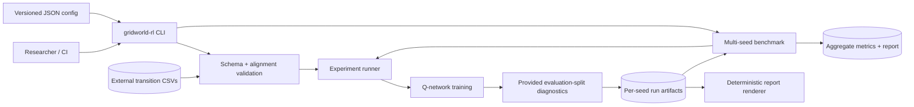
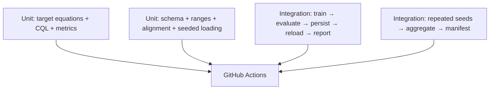

# Architecture

[README](../README.md) ·
[Reproducibility](REPRODUCIBILITY.md) ·
[Technical audit](TECHNICAL_AUDIT.md) ·
[Migration](MIGRATION.md)

## Purpose

Gridworld-10 is structured as a small experiment system rather than a notebook or a
single training script. Its core design goal is **traceability**: a reviewer should
be able to follow a result from input files and configuration, through a testable
target equation, to machine-readable metrics and a generated report.

The package deliberately separates:

- external data validation from tensor conversion;
- mathematical target/loss definitions from optimization;
- training from evaluation;
- per-seed runs from multi-seed aggregation; and
- source code from generated experiment evidence.

## System context



The dataset is an external dependency and remains outside version control. The
evaluation solution crosses the boundary only for scoring: it is not copied into the
prediction artifact or used by the optimizer.

## Package map

The installable source uses the `src/` layout so imports resolve through the package
installation rather than accidentally from the repository root.

| Module | Responsibility | Deliberately does not own |
| --- | --- | --- |
| `config.py` | Typed configuration, JSON parsing/serialization, strict value validation | Dataset I/O or training |
| `data.py` | CSV parsing, schema/range checks, evaluation alignment, coverage/overlap/ambiguity diagnostics, tensor dataset, deterministic `DataLoader` | Target equations |
| `models.py` | Discrete-state MLP that returns one Q-value per action | Optimization policy |
| `algorithms.py` | DQN, Double DQN, Expected SARSA targets, CQL penalty, combined loss | Filesystem or artifact writes |
| `trainer.py` | Per-algorithm optimization, target synchronization, evaluation orchestration, run persistence | Cross-seed statistics |
| `evaluation.py` | Batched greedy predictions, accuracy, confusion matrix, action recall/support | Environment rollouts |
| `checkpoints.py` | Defensive reconstruction of a saved `QNetwork` | Untrusted arbitrary checkpoint formats |
| `report.py` | Per-run figures and Markdown generated from `metrics.json` | Model training |
| `benchmark.py` | Repeated seeded runs, compatible-metric aggregation, mean/std report | Hyperparameter selection |
| `reproducibility.py` | Global seeding, device resolution, SHA-256 file fingerprints | Statistical claims |
| `cli.py` | Stable user-facing command dispatch and concise errors | Domain logic |

`__main__.py` exposes `python -m gridworld_rl`; the installed console script exposes
the equivalent `gridworld-rl` command. The root `main.py` exists only as a
compatibility shim for legacy callers and is not part of the current architecture.

## Experiment lifecycle

### 1. Resolve and validate configuration

`ExperimentConfig` is composed of dataset, network, training, and output sections.
JSON keys are mapped into typed dataclasses. Unknown sections/fields and invalid
ranges fail before expensive work begins.

The resolved configuration—not only the input file—is written to each run as
`config.json`. CLI overrides therefore remain visible in the artifact.

### 2. Validate the data boundary

The required transition contract is:

| Field | Contract |
| --- | --- |
| `state` | Integer in `0..num_states-1` |
| `action` | Integer in `0..num_actions-1`; `-1` is accepted only in a challenge file |
| `reward` | Finite numeric value |
| `next_state` | Integer in `0..num_states-1` |
| `done` | Boolean or unambiguous binary representation |

Validation rejects missing/duplicated columns, empty input, nulls, fractional IDs,
non-finite values, out-of-range identifiers, and ambiguous terminal encodings.
Challenge and solution rows must have equal length and match on `state`,
`next_state`, and `done`.

After validation, `TransitionDataset` materializes typed tensors and
`make_dataloader` owns deterministic shuffling and worker seeds.

The training frame is also summarized without copying transition rows. Diagnostics
include observed states, observed/possible state-action pairs, per-action counts,
terminal fraction, and reward minimum/maximum/mean/standard deviation. These are
coverage indicators, not proof that the learned policy stays in-distribution.

The evaluation solution is audited before its agreement score is interpreted.
Diagnostics report exact full-transition overlap with training, duplicate rows,
states with conflicting action labels, a training-majority reference, a training
per-state-mode reference, and an evaluation-fitted state-mode ceiling. The inspected
snapshot has 99.04% row overlap, so the split cannot support an out-of-sample
generalization claim.

### 3. Train comparable baselines

Each configured algorithm receives the same state/action dimensions, network shape,
optimizer settings, dataset, and declared seed. The seed is reset before each model
is initialized, which controls initial weights and data order for a like-for-like
comparison.

For each batch:

1. the online network predicts `Q(s, ·)`;
2. online and target next-state values are computed without gradient tracking;
3. `algorithms.calculate_loss` chooses the tested target rule;
4. Huber TD loss, plus the CQL term when selected, is backpropagated;
5. gradients are clipped;
6. Adam updates the online network; and
7. the target network is copied after the configured optimizer-step interval.

Loss components are averaged by epoch and persisted. A decreasing objective can help
debug optimization, but it is not itself evidence of policy quality.

### 4. Diagnose agreement on the provided split

Evaluation converts each challenge state into a greedy action using
`argmax_a Q(s,a)`. `classification_metrics` compares these predictions with aligned
solution actions and returns:

- action agreement;
- a `num_actions × num_actions` confusion matrix;
- per-action recall; and
- per-action support.

There is no environment simulator in this path, and the supplied split
substantially overlaps training. The result therefore describes agreement with
provided actions—not out-of-sample generalization or cumulative online return.

### 5. Persist a self-describing run

A single run is written to a unique hidden staging directory beside its destination.
Only after checkpoints, metrics, reports, and the manifest have completed is that
directory published. Failed runs remove their staging directory rather than exposing
partial evidence.

Existing run directories are refused by default. Explicit `output.overwrite=true`
or CLI `--overwrite` replaces a complete run through a backup-and-rename sequence;
the prior directory is restored if publication fails.

```text
<run-directory>/
├── checkpoints/<algorithm>.pt
├── config.json
├── metrics.json
├── predictions.json
├── report.png
├── confusion_matrices.png
├── summary.md
└── manifest.json
```

| Artifact | Contract |
| --- | --- |
| `checkpoints/*.pt` | Model state, algorithm, network dimensions, seed, and update count |
| `config.json` | Fully resolved experiment configuration |
| `metrics.json` | Schema version, source/runtime metadata, dataset hashes, coverage/overlap/ambiguity diagnostics, histories, references, and agreement metrics |
| `predictions.json` | Per-algorithm actions in challenge-row order; no solution labels |
| `report.png` | Training-objective history and action-agreement overview |
| `confusion_matrices.png` | Per-algorithm error structure |
| `summary.md` | Human-readable metrics derived from `metrics.json` |
| `manifest.json` | SHA-256 hashes of the other generated files |

Report generation is intentionally downstream of `metrics.json`. A report can be
recreated without a dataset or checkpoint:

```bash
gridworld-rl report --run-dir artifacts/<run-name>
```

Source provenance is discovered with a bounded, read-only Git probe anchored to the
installed/editable package path, never the caller's current directory. `git_commit`
and `git_dirty` are recorded when repository metadata is available; dirty status
includes tracked changes and untracked, nonignored files. Both fields are `null`
when the package path has no Git checkout, including the production container. The
installed `gridworld_offline_rl` version is always stored under `runtime`; retain an
external release, source-archive, or image reference when Git fields are unavailable.

### 6. Aggregate independent seeds

`benchmark.py` deep-copies a base configuration, assigns one declared seed and unique
run directory per execution, then aggregates compatible run metrics.

```text
artifacts/benchmarks/<benchmark-name>/
├── runs/
│   ├── seed-11/...
│   ├── seed-22/...
│   └── ...
├── benchmark_config.json
├── aggregate_metrics.json
├── benchmark.png
├── benchmark.md
└── manifest.json
```

Aggregate agreement, per-action recall, and the final training objective include the
mean, sample standard deviation, minimum, and maximum. The report also plots the
training-majority and training state-mode references plus the explicitly
evaluation-fitted state-mode ceiling. The aggregate manifest covers both top-level
benchmark outputs and each nested run artifact.

The benchmark runner automates repetition; it does not make the evaluation protocol
statistically valid by itself. Seed selection, sample size, hyperparameter tuning,
and claim scope remain research decisions.

Benchmark destinations are immutable: an existing name is always refused, and a
failed benchmark removes its incomplete directory. The top-level manifest represents
the benchmark directory at completion time. Regenerating a nested per-seed report
later changes nested files and therefore invalidates the top-level hashes; preserve
the completed directory unchanged or rerun the benchmark under a new name.

## Algorithm boundary

Target equations are pure tensor operations. This makes online/target roles and
terminal masking directly testable with small numerical examples.

### DQN

```text
y = r + γ(1-d) max_a Q_target(s', a)
```

### Double DQN

```text
a* = argmax_a Q_online(s', a)
y  = r + γ(1-d) Q_target(s', a*)
```

### Expected SARSA

For `n` actions:

```text
π(a|s') = ε/n + (1-ε) · 1[a = argmax Q_online(s', ·)]
y       = r + γ(1-d) Σ_a π(a|s')Q_target(s', a)
```

Ties follow PyTorch `argmax` behavior: the first maximal index receives the greedy
probability mass.

### Discrete CQL

The current discrete CQL baseline uses the DQN target and adds:

```text
L_CQL = E_s[logsumexp_a Q_online(s,a) - Q_online(s,a_dataset)]
L     = L_Huber-TD + αL_CQL
```

This is an offline regularizer over the finite action set, not a complete
implementation of every CQL variant.

## Trust and safety boundaries

- **CSV files are untrusted input.** They are parsed and validated before tensor
  indexing, but users should still obtain them from an authorized source.
- **Evaluation labels are privileged.** Repeatedly tuning against the solution turns
  it into a validation set; the code cannot prevent a researcher from doing this.
- **The supplied split is overlapping and ambiguous.** Exact transition overlap,
  duplicates, and conflicting state labels are reported, but no statistic can turn
  this snapshot into an out-of-sample test set.
- **Checkpoints are binary inputs.** The loader uses `weights_only=True` and validates
  required payload keys, but only trusted checkpoints should be loaded.
- **Manifests detect change, not intent.** SHA-256 hashes show whether files match a
  recorded run; they do not authenticate who created the run.
- **Containers limit process privilege, not data exposure.** Dataset mounts should be
  read-only and artifact mounts should contain no secrets.

## Testing strategy



Unit tests use hand-checkable tensors and synthetic frames. Integration tests create
small temporary CSVs, so CI does not require or redistribute the external dataset.

## Extension points

### Add an algorithm

1. Add its canonical name to `SUPPORTED_ALGORITHMS`.
2. Implement the target or penalty in `algorithms.py`.
3. Route it through `calculate_loss` with explicit online/target roles.
4. Add a hand-checkable unit test, including terminal behavior.
5. Add the method to reporting display names if needed.
6. Document whether its assumptions remain valid in a fixed-dataset setting.

### Change the artifact schema

Increment the relevant `schema_version`, update both writer and reader, add a
backward-compatibility decision, and test report/benchmark consumption. Do not
silently reinterpret an existing field.

### Add online return evaluation

Introduce it as a separate component with a specified environment transition
function, one action per step, boundary handling, termination/truncation rules, and
seeded episodes. Keep return metrics separate from action agreement.

## Design trade-offs

- **One-hot state representation:** simple and inspectable for 100 discrete states;
  it does not encode spatial locality.
- **In-memory dataset:** appropriate for this small CSV dataset; larger corpora would
  need streaming or memory-mapped storage.
- **Hard target copies:** easy to reason about and test; soft/Polyak updates are not
  currently implemented.
- **Single-process benchmark orchestration:** maximizes determinism and keeps artifact
  ownership simple; it favors clarity over maximum throughput.
- **JSON artifacts:** portable and diffable for this scale; large experiments may
  require a columnar or database-backed tracking layer.
