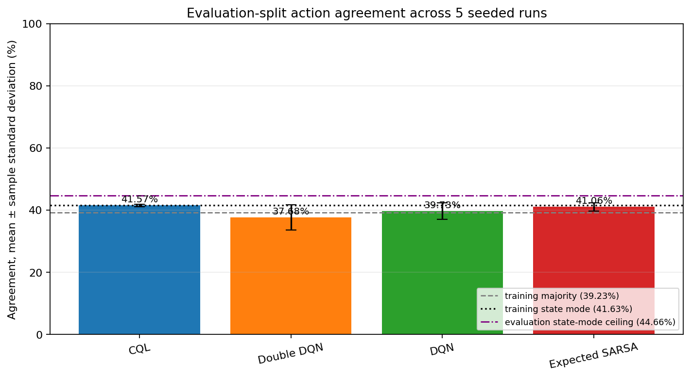

# Five-Seed Diagnostic Benchmark

[README](../../README.md) ·
[Reproducibility](../REPRODUCIBILITY.md) ·
[Architecture](../ARCHITECTURE.md)

## Status

This is a **pre-release diagnostic snapshot**, generated locally on 31 July 2026 to
exercise the complete multi-seed pipeline. It is included because the class-level
results expose a substantive model limitation that overall accuracy alone would
hide.

The run occurred after the version 2.0 refactor was present in the working tree but
before that refactor had an immutable commit. The configuration, data fingerprints,
runtime, seed schedule, and generated metrics are known; the exact source state is
not recoverable from a Git commit. Rerun from the eventual tagged release before
using these values as a formal public benchmark.

## Protocol

```bash
gridworld-rl benchmark \
  --config configs/default.json \
  --seeds 11 22 33 44 55 \
  --output-dir /tmp/gridworld-showcase-verification \
  --name five-seed
```

| Dimension | Value |
| --- | --- |
| Seeds | 11, 22, 33, 44, 55 |
| Training rows | 22,172 |
| Evaluation rows | 5,544 |
| Exact train/evaluation transition overlap | 5,491 / 5,544 rows (99.04%) |
| Unique full evaluation transitions | 534 (5,010 duplicate rows) |
| Evaluation states with conflicting actions | 77 / 91 |
| Logged state-action coverage | 346 / 400 pairs (86.5%) |
| Logged action counts | a0: 2,940; a1: 8,428; a2: 2,919; a3: 7,885 |
| Algorithms | DQN, Double DQN, Expected SARSA, CQL |
| Epochs | 20 |
| Network | One-hot state input; hidden widths 128 and 64; four outputs |
| Optimizer | Adam, learning rate 0.001 |
| Batch size | 128 |
| Discount | 0.99 |
| Expected SARSA epsilon | 0.1 |
| CQL alpha | 1.0 |
| Target synchronization | Every 250 optimizer steps |
| Gradient clipping | Maximum norm 10.0 |
| Runtime | Python 3.12.13; PyTorch 2.11.0; NumPy 2.4.4; pandas 3.0.2; Matplotlib 3.10.8 |
| Device | CPU |

Dataset SHA-256 fingerprints:

```text
train           58a517870fe94fdec3e5bc53790a436f68fc5bbabf303adb031adbe5a1aba686
eval_challenge  dc82210503d3c0aa084c6b194b0b372f51bdbdd10121c36fd53a7f51806ef2dc
eval_solution   a49bf745e7ac3d9db082e21010e0bc36e530c49b0c7255ad13c4273b234d19f1
```

## Aggregate action agreement

Values are mean ± sample standard deviation across the five declared seeds.
Minimum and maximum are shown to make the observed range explicit.

| Algorithm | Mean ± std | Minimum | Maximum |
| --- | ---: | ---: | ---: |
| CQL | 41.57% ± 0.40% | 41.13% | 42.08% |
| Expected SARSA | 41.06% ± 1.30% | 38.74% | 41.88% |
| DQN | 39.73% ± 2.61% | 35.84% | 42.08% |
| Double DQN | 37.68% ± 4.03% | 31.93% | 41.38% |
| Training-majority reference (always action 1) | 39.23% | 39.23% | 39.23% |
| Training per-state-mode reference | 41.63% | 41.63% | 41.63% |
| Evaluation-fitted state-mode ceiling | 44.66% | 44.66% | 44.66% |

The first two references are selected only from training labels and then scored on
the evaluation split. The ceiling chooses the most frequent evaluation label for
each evaluation state, so it is an oracle diagnostic rather than a fair predictive
baseline.



## Per-action diagnostic

The solution support is fixed across seeds: action 0 has 698 examples, action 1 has
2,175, action 2 has 734, and action 3 has 1,937. Mean recall across seeds was:

| Algorithm | Action 0 | Action 1 | Action 2 | Action 3 |
| --- | ---: | ---: | ---: | ---: |
| CQL | 0.00% | 40.63% | 0.14% | 73.32% |
| Expected SARSA | 0.00% | 49.79% | 3.24% | 60.37% |
| DQN | 0.03% | 46.67% | 3.76% | 59.87% |
| Double DQN | 2.95% | 37.31% | 4.03% | 63.38% |

The learned greedy policies strongly favor actions 1 and 3. In particular, CQL and
Expected SARSA achieved zero recall for action 0 in every seed, and DQN's mean action
0 recall was effectively zero. Action 2 recall was also poor for every method.

The logged training data itself is imbalanced toward actions 1 and 3, despite
covering 346 of the 400 possible state-action pairs. Aggregate pair coverage says
that a pair appears at least once; it does not describe visit frequency,
state-conditional support quality, or how often a learned policy selects actions
outside well-supported regions.

More fundamentally, this evaluation split cannot estimate out-of-sample
generalization: 99.04% of its rows exactly reproduce a transition present in
training, it contains only 534 unique full transitions across 5,544 rows, and 77 of
91 states carry conflicting action labels. The 44.66% evaluation-fitted state-mode
ceiling quantifies how much ambiguity remains for any deterministic policy that
receives only the state.

This changes the interpretation of the aggregate table:

- CQL had the highest mean agreement and lowest observed variation in this run, but
  did not recover action 0 and almost never recovered action 2.
- Always choosing the most frequent training action would score 39.23%, while a
  per-state training mode scores 41.63%; no learned method exceeded that stronger
  trivial reference on average.
- The small mean differences do not establish superiority; no inferential test or
  confidence interval was predeclared.
- The final CQL objective includes a conservative penalty and is not numerically
  comparable with the TD-only objectives.
- A confusion matrix and class support are essential; one scalar can mask action
  collapse.

## Claim boundary

This snapshot supports the engineering statement that the current pipeline can run
all four methods over multiple seeds and persist aggregate and class-level
diagnostics.

It does not support claims about:

- online cumulative return;
- out-of-sample policy generalization;
- an optimal or safe policy;
- statistical superiority;
- transfer to another dataset or state representation; or
- a clean-release reproduction.

For a publishable rerun, follow the
[reproducibility protocol](../REPRODUCIBILITY.md), record the source commit, preserve
the complete benchmark directory, and avoid further tuning on the same evaluation
solution.
